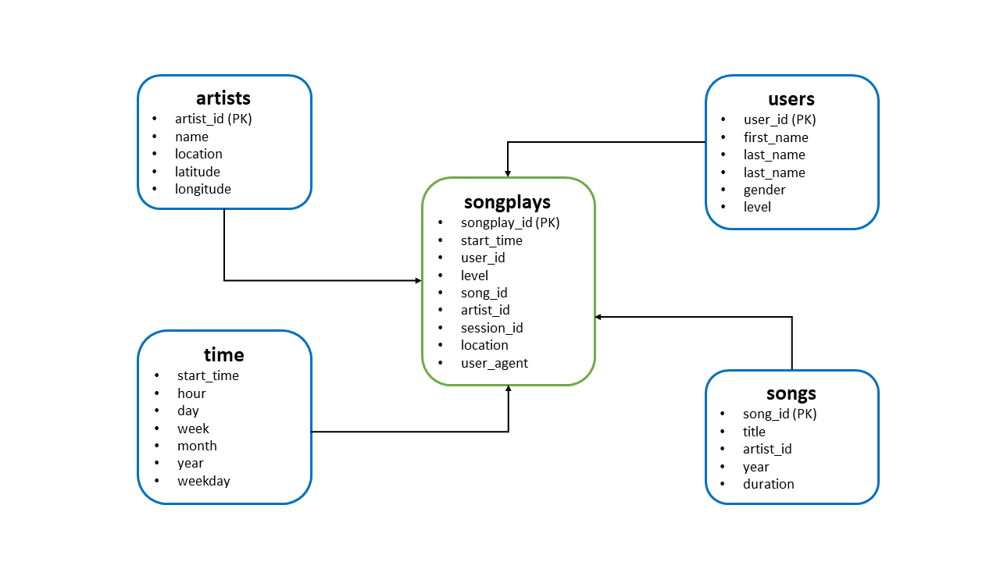
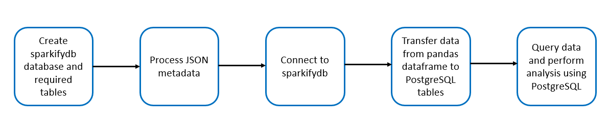
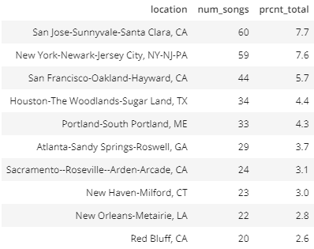
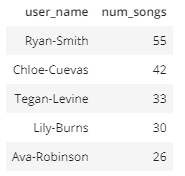

# Sparkify Music Streaming App
### Database and ETL Pipeline to Enable Product and User Analytics

# Objective
Sparkify, a **fake** streaming music app that was launched during the COVID-19 pandemic, required help to enables its data analysts to evaluate trends and user habits. 
There were two raw data sources comprised of JSON metadata. One source was a log of user activity and the other consisted of the songs available on the app.

# Schema 
Based on the startup's requirements, I designed a Star-schematized database, called `sparkifydb`, which simplified queries and allowed for fast aggregation. The database achieved Third Normal Form (3NF) which removed duplicate data values and allowed Sparkify to update the database by only revising one cell.

# ETL Pipeline
1)	Execute `create_tables.py` to construct the `sparkifydb` database and tables shown in the schema displayed above.
2)	Run `etl.py` to perform the following actions:
    - Process the JSON files, i.e. (listening) log and song datasets;
    - Connect to the `sparkifydb` database;
    - Run `sql_queries.py` to insert the raw data into its corresponding table. 
3) Perform desired analysis using PostgreSQL in `test.ipynb`.

### Notes:
-  Must run `create_tables.py` before running `test.ipynb`, `etl.ipynb`, and `etl.py`.
-  The songs are filtered on "NextSong", a variable within the "action" attribute of the log data.

# Example Queries

Now that Sparkify has a schematized database, the startup can perform product and user analysis. The following are two examples:

#### Top 10 Markets 

#### Top 5 Most Frequent Users

# Packages
- Pandas
- Psycopog2

